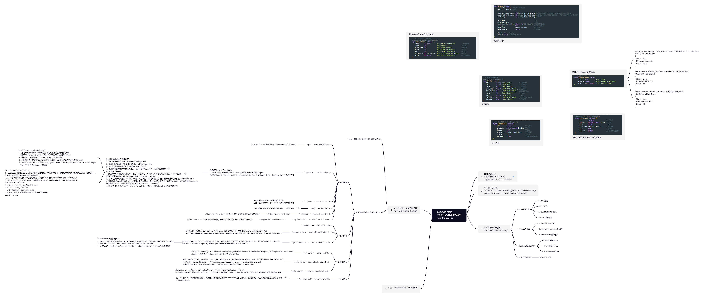

# BitSearch

该项目是`BitSearch`搜索引擎的后端部分，前端部分见https://github.com/yccye/BitSearch_FrontEnd

后端部分参考了项目[GoFound](https://github.com/newpanjing/gofound)

`BitSerach`是一个Golang实现的全文检索引擎，支持纯文本信息的搜索、输入文本搜索图片、自定义关键词过滤等功能

### 项目技术栈

-   爬虫部分：[Jiebago](https://github.com/wangbin/jiebago)（中文分词）+ [stopwords](https://github.com/goto456/stopwords)（停用词表过滤）

-   前端部分：[React](https://github.com/facebook/react)（框架） + [Ant Design](https://github.com/ant-design/ant-design)（UI）
-   后端部分：[Gin](https://github.com/gin-gonic/gin)（框架）+ [LevelDB](https://github.com/syndtr/goleveldb)（持久化）

### 安装和启动

>   注：克隆项目代码到本地后，将searcher/words/data文件夹复制到项目根目录

-   下载数据集csv文件夹，放到项目根目录的data文件夹下，也可以按照对应的格式自定义数据集放在文件中

    数据集：链接：https://pan.baidu.com/s/1jIGU6ZkMSmVCSxz5AInTzw  提取码：56p7 

-   编译并启动

    ```go
    go build && ./BitSearch.exe
    ```

-   如需要更改配置信息（如监听地址及端口、数据库存放目录、`leveldb`内索引文件的默认分块数目等信息）可在编译项目前修改根目录下的`config.yaml`

### 项目主要功能点

>   对于搜索网页及搜索图片，本项目采用了两个数据库（WebPage和Image）来分别存储图像搜索和网页搜索的数据，在接口地址中通过指定数据库名执行对应内容的搜索

1.  文字搜索网页(采用自行爬取的数据)

    **请求**

    | 接口地址 | http://127.0.0.1:5678/api/query?database=WebPage |
    | -------- | ------------------------------------------------ |
    | 请求方式 | POST                                             |
    | 请求类型 | application/json                                 |

    ```json
    {
      "query": "疫情情况",  //查询内容
      "page": 1,  //查询结果当前页码
      "limit": 10,  //每页显示的最大结果数量
      "order": "desc",  //结果排序
      "filterwords": [
          "唐山"  //过滤词, 结果中包含过滤词的内容会被过滤
      ]
    }
    ```

    **响应**

    ```
    {
        "state": true,
        "message": "success",
        "data": {
            "time": 0.5461,  //响应时间ms
            "total": 910,  //查询结果总数
            "pageCount": 91,  //查询结果的分页数
            "page": 1,  //当前结果所在页码
            "limit": 10,  //每页显示的最大结果数量
            "documents": [
                {
                    "id": 81776,
                    "text": "月日河南省新型冠状病毒肺炎疫情最新情况",
                    "document": {
                        "URL": "http://ha.news.cn/news/2022-05/21/c_1128670995.htm",
                        "cid": 81776,
                        "title": "月日河南省新型冠状病毒肺炎疫情最新情况"
                    },
                    "score": 2,
                    "keys": [
                        "日",
                        "肺炎",
                        "疫情",
                        "冠状病毒",
                        "最新",
                        "月",
                        "河南",
                        "河南省",
                        "新型",
                        "冠状",
                        "病毒",
                        "情况"
                    ]
                },
                {
                    "id": 1006,
                    "text": "疫情过后楼市情况会怎样",
                    "document": {
                        "URL": "https://ask.leju.com/bj/detail/295626048853245952/?bi=tg&type=sina-pc&pos=index-esf",
                        "cid": 1006,
                        "title": "疫情过后楼市情况会怎样"
                    },
                    "score": 2,
                    "keys": [
                        "过后",
                        "楼市",
                        "情况",
                        "疫情"
                    ]
                },
                ...
        }
    }
    ```

2.  文字搜索图片(使用了WUKONG数据集)

    **请求**

    | 接口地址 | http://127.0.0.1:5678/api/query?database=Image |
    | -------- | ---------------------------------------------- |
    | 请求方式 | POST                                           |
    | 请求类型 | application/json                               |

    ```json
    {
      "query": "柯南",
      "page": 1,
      "limit": 10,
      "order": "desc",
      "filterwords": [
          "堆糖网"
      ]
    }
    ```

    **响应**

    ```
    {
        "state": true,
        "message": "success",
        "data": {
            "time": 0.5236,
            "total": 11,
            "pageCount": 2,
            "page": 1,
            "limit": 10,
            "documents": [
                {
                    "id": 31710,
                    "text": "柯南警探追求真相安卓版",
                    "document": {
                        "URL": "\"https://gimg2.baidu.com/image_search/src=http%3A%2F%2Fpic.962.net%2Fup%2F2019-6%2F15613462656717527.jpg&refer=http%3A%2F%2Fpic.962.net&app=2002&size=f9999",
                        "cid": 31710,
                        "title": "柯南警探追求真相安卓版"
                    },
                    "score": 1,
                    "keys": [
                        "柯南",
                        "警探",
                        "追求",
                        "真相",
                        "安卓版"
                    ]
                },
                {
                    "id": 21529,
                    "text": "名侦探柯南——原来小哀才是真正的影后",
                    "document": {
                        "URL": "\"https://gimg2.baidu.com/image_search/src=http%3A%2F%2Fp0.ifengimg.com%2Fpmop%2F2017%2F04%2F13%2F0951fe1b-e9f7-4e5c-8a64-15defaa7b0bd.jpg&refer=http%3A%2F%2Fp0.ifengimg.com&app=2002&size=f9999",
                        "cid": 21529,
                        "title": "名侦探柯南——原来小哀才是真正的影后"
                    },
                    "score": 1,
                    "keys": [
                        "小哀",
                        "名",
                        "侦探",
                        "影后",
                        "柯南"
                    ]
                },
                ...
        }
    }
    ```

3.  搜索提醒

    **请求**

    | 接口地址 | http://127.0.0.1:5678/api/reminder |
    | -------- | ---------------------------------- |
    | 请求方式 | POST                               |
    | 请求类型 | application/json                   |

    ````
    {
      "query": "上"
    }
    ````

    **响应**

    ```
    {
        "state": true,
        "message": "success",
        "data": [
        	"上海",
        	"上海滩",
        	"上海交通大学"
        ]
    }
    ```

4.  搜索热词

    **请求**

    | 接口地址 | http://127.0.0.1:5678/api/trend |
    | -------- | ------------------------------- |
    | 请求方式 | GET                             |
    | 请求类型 | application/json                |

    **响应**

    ```
    {
        "state": true,
        "message": "success",
        "data": [
            {
                "Heat": 6,
                "Word": "上海"
            },
            {
                "Heat": 1,
                "Word": "交通"
            },
            {
                "Heat": 1,
                "Word": "跳动"
            },
            {
                "Heat": 1,
                "Word": "字节"
            },
            {
                "Heat": 1,
                "Word": "海滩"
            },
            {
                "Heat": 1,
                "Word": "大学"
            },
            {
                "Heat": 1,
                "Word": "上海滩"
            },
            {
                "Heat": 1,
                "Word": "上海交通大学"
            }
        ]
    }
    ```

5.  搜索分页

    搜索分页由搜索请求中的page参数来决定页数，这里不重复说明

6.  过滤搜索

    过滤由搜索请求中的filterwords参数来决定页数，这里不重复说明

### 项目结构

-   项目的具体流程图可参考下图 完整文件见 https://www.processon.com/view/link/629f30f16376890758527652

    

```shell
├── BitSearch.exe
├── README.md
├── bootstrap                   #引导文件, 负责爬虫文件读取等功能
│   ├── csv.go
│   └── template.go
├── config.yaml                 #项目配置信息
├── core                        #负责初始化及配置信息的解析
│   ├── initialize.go
│   └── parser.go
├── data                        #爬虫源数据及分词词典存放目录
│   ├── csv
│   │   ├── IDCONTENT.csv
│   │   ├── IDURL.csv
│   │   └── WUKONG.csv
│   ├── dict.txt
│   ├── dictionary.txt
│   └── stopwords.txt
├── database                    #leveldb数据库文件存放目录
│   ├── Image
│   └── WebPage
├── global                      #服务器设置
│   ├── config.go
│   └── global.go
├── go.mod
├── go.sum
├── main.go
├── searcher                    #搜索引擎相关
│   ├── arrays
│   │   └── arrays.go
│   ├── container.go
│   ├── engine.go
│   ├── model
│   │   ├── doc.go              #索引结构相关
│   │   ├── item.go
│   │   └── search.go
│   ├── pagination              #分页相关
│   │   └── pagination.go
│   ├── sorts
│   │   └── fast.go
│   ├── statistic               #搜索历史，热词相关
│   │   └── search_record.go
│   ├── storage
│   │   └── leveldb_storage.go
│   ├── system                  #获取系统信息
│   │   ├── cpu.go
│   │   ├── disk.go
│   │   ├── mem.go
│   │   └── utils.go
│   ├── utils                   #通用的编解码, 哈希算法相关
│   │   └── utils.go
│   └── words
│       ├── data
│       │   ├── dict.txt
│       │   ├── dictionary.txt
│       │   └── stopwords.txt
│       └── tokenizer.go
└── web
    ├── controller              #路由的Handler相关
    │   ├── base.go
    │   ├── database.go
    │   ├── index.go
    │   ├── response.go
    │   ├── services.go
    │   └── word.go
    ├── middleware
    │   ├── cors.go
    │   └── exception.go
    ├── result.go
    ├── router                  #注册路由相关
    │   ├── base.go
    │   ├── database.go
    │   ├── index.go
    │   ├── router.go
    │   └── word.go
    └── service                 #Handler的底层实现
        ├── base.go
        ├── database.go
        ├── index.go
        ├── service.go
        └── word.go
```

### 项目演示
https://www.bilibili.com/video/BV1k94y1m7Yo?spm_id_from=333.999.0.0
